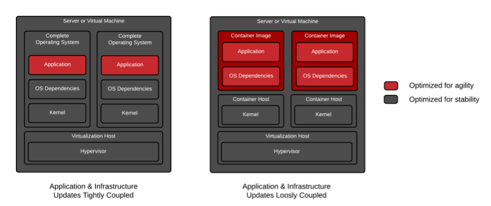

# My First CodeLab

[Codelab Feedback](https://github.com/snehangshuk/codelab/issues)


## Introduction


### Overview of Container Technology

**Last Updated:** 2019-04-30

### **Containerized Applications**

Software applications typically depend on other libraries, configuration files, or services provided by the runtime environment. The traditional runtime environment for a software application is a physical host or virtual machine, and application dependencies are installed as part of the host.

For example, consider a Python application that requires access to a shared library that implements the TLS protocol. Traditionally, a system administrator installs the required package that provides the shared library before installing the Python application.

The major drawback to traditionally deployed software applications is that the application's dependencies are entangled with the runtime environment. An application may break when updates or patches are applied to the base operating system (OS).

For example, an OS update to the TLS shared library removes TLSE1.0 as a supported protocol. This breaks the deployed Python application because it is written to use the TLSE1.0 protocol for network requests. This forces the system administrator to roll back the OS update to keep the application running, preventing other applications from using the benefits of the updated package. Therefore, a company developing traditional software applications may require a full set of tests to guarantee that an OS update does not affect applications running on the host. Furthermore, a traditionally deployed application must be stopped before updating the associated dependencies. To minimize application downtime, organizations design and implement complex systems to provide high availability of their applications. Maintaining multiple applications on a single host often becomes cumbersome, and any deployment or update has the potential to break one of the organization's applications.

The below figure describes the difference between applications running as containers and applications running on the host operating system.



Alternatively, a software application can be deployed using a container. A container is a set of one or more processes that are isolated from the rest of the system. Containers provide many of the same benefits as virtual machines, such as security, storage, and network isolation. Containers require far fewer hardware resources and are quick to start and terminate. They also isolate the libraries and the runtime resources (such as CPU and storage) for an application to minimize the impact of any OS update to the host OS.

The *Open Container Initiative* provides a set of industry standards that define a container runtime specification and a container image specification.

There are many *container engines* available to manage and execute individual containers, including Rocket, Drawbridge, LXC, Docker, and Podman.

The following are other major advantages to using containers:

* Low hardware footprint
* Environment isolation
* Quick deployment
* Multiple environment deployment
* Reusability

Further, containers are an ideal approach when using microservices for application development. Each service is encapsulated in a lightweight and reliable container environment that can be deployed to a production or development environment. The collection of containerized services required by an application can be hosted on a single machine, removing the need to manage a machine for each service.

In contrast, many applications are not well suited for a containerized environment. For example, applications accessing low-level hardware information, such as memory, file systems, and devices may be unreliable due to container limitations.

> aside negative
> 
> **Note:** To simplify this codelab, and explain the fundamentals of providing an offline experience, we're using vanilla JavaScript. In a production app, we strongly recommend using tools like  [Workbox](https://developers.google.com/web/tools/workbox/) to build your service worker. It removes many of the sharp edges and dark corners you may run into.

### **What you'll learn**

* Containers and Kubernetes

### **What you'll need**

* Linux skills


## Getting set up
Duration: 02:00


### **Get the tools needed**

Kuberntes website provides all the tools you need to set up the cluster.

<button>[Download the Tools](https://kubernetes.io/)</button>

> aside positive
> 
> **Note:** You do not need this if tools are already installed.

#### **Verify you have all the tools**

To test that you do the blah

> aside negative
> 
> **Caution:** Blah Blah

### **Get the container**

We've put everything you need for this project into a Git repo. To get started, you'll need to grab the code and open it in your favorite dev environment.

#### **Strongly Recommended: Use GitHub to import the repo**

#### **Alternative:** 

Check this Bash script:

```
# Download Gnu Parallel
wget http://ftp.gnu.org/gnu/parallel/parallel-latest.tar.bz2
tar -jxvf parallel-latest.tar.bz2
cd parallel-latest
./configure
make && sudo make install

# Go to instance store
cd /media/ephemeral0/
sudo chmod 777 .
```


